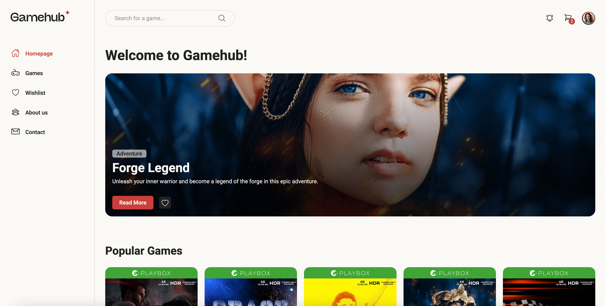

# JS1 Course Assignment

**Desktop:** 

On this project we had to decide to use a exsisting (Rainydays) project, or a fresh project. I decided to start a fresh one. I chose the online game store "Gamehub" focused on browsing, filtering, and buying games with an intuitive checkout experience.

---

## 📝 Description

For this project we used new JavaScript skills to create an interactive online store that displays products from an API endpoint. We could choose from **Rainy Days API**, **GameHub API**, or **Square Eyes API**. The products are displayed in HTML and users can create a basket of items.

- **Home** – Popular and new releases games, and get an introduction to the store.
- **Games** – View all available games and filter by genre.
- **Product** – See detailed information about a selected game, including image, price, and description.
- **Checkout** – Review your cart, enter your details, and complete your purchase.

## 🛠️ Built With

Main tools and technologies used in this project:


---

## 📦 Installation

Follow these steps to get a copy of the project running locally:

1. Clone the repository:

   ```bash
   git clone https://github.com/helenesyre/JS1-helene-syre.git
   ```

2. Open the repository:

   ```bash
     cd JS1-helene-syre
   ```

3. Run Local Server

   Install dependencies and start the development server:

   ```bash
   npm install
   npm run dev
   ```

## 📜 License

MIT License

---

## 👋 Contact

Helene Syre - [@syre_design](https://www.instagram.com/syre_design/) - syrehelene@gmail.com

Project Link: [https://helenesyre.github.io/PE1-helene-syre/](https://helenesyre.github.io/PE1-helene-syre/)

Portfolio: [https://helenesyre.github.io/portfolio/#/](https://helenesyre.github.io/portfolio/#/)
